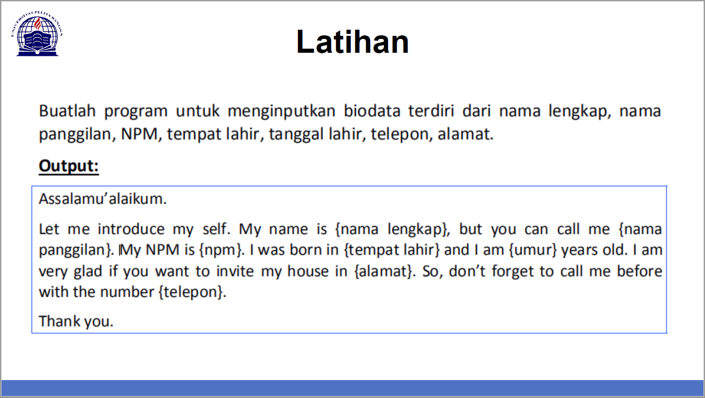

# Tugas Pertemuan 5 & 6

Repository ini  digunakan untuk memenuhi Tugas Bahasa Pemrograman di pertemuan ke 6

Nama    : Faza Ardan Kusuma<br>
NIM     : 312010001<br>
Kelas   : TI.20.B1<br>

## Daftar isi
| No | Deskripsi | Link |
| ----- | ----- | ----- |
| 1 | Tugas Pertemuan 5 | [Click here](#pertemuan-5---tugas-bahasa-pemrograman-python) |
| 2 | Tugas Pertemuan 6 | [Click here](#pertemuan-6---tipe-data-variable-dan-operator) |
| 3 | Tugas Pertemuan 6 Lab 1.1 | [Click here]() |
| 4 | Tugas Pertemuan 6 Lab 1.2 | [Click here]() |
| 5 | Tugas Pertemuan 6 Lab 2 | [Click here]() |
<br>

## Pertemuan 5 - Tugas Bahasa Pemrograman Python
Tugas pertemuan ke 5 Bahasa Pemrograman membuat **Aplikasi Biodata** dengan menggunakan **Bahasa Python**. Berikut tugasnya :
    

***Source code*** untuk aplikasi Tugas 5 ([Tugas 5 Python](p5_tugas.py)) :
``` python
print("Please enter full name : ")
fullname=input()

print("please insert your Nickname : ")
nickname=input()

print("please enter your NPM : ")
NPM=input()

print("please enter your Born place : ")
bornplace=input()

print("please insert your age : ")
age=input()

print("please enter your home address : ")
address=input()

print("please enter your phone number : ")
phonenumber=input()


print("\nAssalamualaikum Wr, Wb.")
print(f"\nLet me introduce my self. My name is {fullname}, but you can call me {nickname}. My NPM is {NPM}. I was Born in {bornplace} and i am {age} years old. I am very glad if you want to invite my house in {address}. So, don't forget to call me before with the number {phonenumber}.")
print("\nThank you.")
print("\n")
```

Berikut penjelasannya : <br>
```python
print("Please enter full name : ")
```
Source code berfungsi untuk menampilkan output berupa **" Please enter your full name : "**.


Untuk source code selanjutnya adalah inputan variable.
```python
fullname=input()
```
>Keterangan :
>1. Variable adalah  sebuah wadah penyimpanan data pada program yang akan digunakan selama program itu berjalan. Pada source code diatas yang berfungsi sebagai variable adalah **fullname**
>2. Fungsi **input()** adalah memasukkan nilai dari command prompt ke nilai kita saat menekan tombol enter 
><br>
>Pada gambar diatas, hasil dari inputan berwarna hijau
>* Untuk memasukkan perintah lain seperti <i>Nickname, NPM, Place of birth, Age, Address dan Number</i> mengikuti perintah yang sama seperti memasukkan <i>fullname</i>

Untuk menampilkan salam, ketikkan syntax berikut :
```python
print("\nAssalamualaikum Wr, Wb.")
```
>Keterangan :
>Fungsi **\n** pada adalah untuk memberi baris baru atau enter
>Fungsi **print()** adalah hasil dari source code atau syntax, seperti gambar di bawah :
>

Langkah terakhir untuk menampilkan dari semua hasil input, dengan mengetikkan syntax berikut :
``` python
print(f"\nLet me introduce my self. My name is {fullname}, but you can call me {nickname}. My NPM is {NPM}. I was born in {placeofbirth} and i am {age} years old. I am very glad if you want to invite my house in {address}. So, don't forget to call me before with the number {phonenumber}.")
print("\nThank you.")
print("\n")
```
>Keterangan :
>1. Fungsi dari huruf **f** pada syntax ***print(f"....")*** adalah memudahkan  programmer dalam mencetak statement dalam satu baris dibandingkan dengan metode yang lama yaitu memisahkan string dan variable dalamm simbol koma (,) atau plus (+) 
>2. Fungsi dari **{}** pada output tersebut adalah untuk menampilkan hasil dari variable

Hasil dari output Tugas 5


## Pertemuan 6 - Tipe Data, Variable, dan Operator

Pada tugas pertemuan 6 ada 3 Lab, yaitu :
* Lab 1.1
* Lab 1.2
* Lab 2

### Lab 1.1
Lab 1.1 tentang penggunaan ***End*** dan ***Separator***
Source code [Lab 1.1](p6_lab1.2.py)

``` python
#penggunaan end
print('A', end='')
print('B', end='')
print('C', end='')
print()
print('X')
print('Y')
print('z')

#penggunaan separator
w, x, y, z = 10, 15, 20, 25
print(w, x, y, z)
print(w, x, y, z, sep=',')
print(w, x, y, z, sep='')
print(w, x, y, z, sep=':')
print(w, x, y, z, sep='-----')
```

1. Penggunaan End<br>
    Digunakan untuk ganti baris
    ``` python
    print('A', end='')
    print('B', end='')
    print('C', end='')
    ```
    Penggunaan **print()** digunakan untuk mencetak output seperti syntax dibawah :
    ``` python
    print()
    Syntax dibawah digunakan untuk menampilkan output berupa string
    ``` python
    print('X')
    print('Y')
    print('z')
    ```
    Hasil dari source code End<br>
    

2. Penggunaan Separator<br>
    Digunakan sebagai sebagai pemisah antar objek yang di cetak

    * Pendeklarasian beberapa variable berserta nilainya
    ``` python
    w, x, y, z = 10, 15, 20, 25
    ```
    * Menampilkan hasil dari tiap - tiap variable
    ``` python
    print(w, x, y, z)
    ```
    * Menampilkan hasil dari tiap - tiap variable dengan menggunakan pemisah **, (koma)**
    ```
    print(w, x, y, z, sep=',')
    ```
    * Menampilkan hasil dari tiap - tiap variable tanpa pemisah
    ```
    print(w, x, y, z, sep='')
    ```
    * Menampilkan hasil dari tiap - tiap variable dengan menggunakan pemisah **: (titik dua)**
    ```
    print(w, x, y, z, sep=':')
    ```
    * Menampilkan hasil dari tiap - tiap variable dengan menggunakan pemisah **-----**
    ```
    print(w, x, y, z, sep='-----')
    ```
    Hasil dari source code Separator<br> 
    
    
### Lab 1.2
Lab 1.2 tentang ***String format***
Memungkinkan untuk menyuntikkan item kedalam string dari pada kita mencoba menggabungkan string menggunakan koma atau  string concatenation<br>
Source code [Lab 1.2](p6_lab1.py)

``` python
#string format
print(0, 10**0)
print(1, 10**1)
print(2, 10**2)
print(3, 10**3)
print(4, 10**4)
print(5, 10**5)
print(6, 10**5)
print(8, 10**8)
print(9, 10**9)
print(10, 10**10)

#string format
print('{0:>3} {1:>16}'.format(0, 10**0))
print('{0:>3} {1:>16}'.format(1, 10**1))
print('{0:>3} {1:>16}'.format(2, 10**2))
print('{0:>3} {1:>16}'.format(3, 10**3))
print('{0:>3} {1:>16}'.format(4, 10**4))
print('{0:>3} {1:>16}'.format(5, 10**5))
print('{0:>3} {1:>16}'.format(6, 10**6))
print('{0:>3} {1:>16}'.format(7, 10**7))
print('{0:>3} {1:>16}'.format(8, 10**8))
print('{0:>3} {1:>16}'.format(9, 10**9))
print('{0:>3} {1:>16}'.format(10, 10**10))
```

1. String Format 1
Pada format ini akan menampilkan 2 output, yaitu **nomor urut pada sebelah kiri** dan **Operasi Aritmatika pada sebelah kanan**. Dengan ketentuan operasi pangkat dengan angka kiri sebagai pokok (rumus : **[bintang dua])
Hasil dari source code string format pertama<br> 


2. String Format 2
Pada string format ke 2, tetap menampilkan 2 output tapi dengan ketentuan alignment, padding, dan precision dengan **.format()** dalam kurung kurawal kita dapat menetapkan panjang bidang rata kanan atau kiri, parameter pembulatan dan banyak lagi
Hasil dari source code string format kedua<br>
~[String format 2](Pic/stringformat2.png)

### Lab 2
Pada lab 2 akan membahas Konversi nilai variable<br>
Source code [Konversi Nilai variable](p6_lab2.py)

<br>
``` python
a=input("masukkan nilai a:")
b=input("masukkan nilai b:")
print("variable a=",a)
print("variable b=",b)
print("hasil penggabungan {1}&{0}=%d".format(a,b) %(a+b))

#konversi nilai variable
a=int(a)
b=int()
print("hasil pejumlahan {1}+{0}".format(a,b) %(a+b))
print("hasil pembagian {1}/{0}=%d".format(a,b) %(a/b))
```

Pada source code yang telah diberikan ada kesalahan, jadi saat di run program tersebut menjadi error. <br>
<br>
Pada source code diatas, berikut adalah errornya :
>TypeError: %d format: a number is required, not str

Maksud dari error tersebut adalah variable **a** dan **b** terbaca sebagai string, yang seharusnya dibaca sebagai **integer** atau **number**.
Pada baris ke 5(dinotifikasi ditampilkan juga bahwa pada baris no 5 ada error), yaitu pada pemformatan **.format** adalah integer, sedangkan jika berupa string maka akan ada tanda petik dua("...") pada pemformatan **.format()**

Harusnya inputannya adalah integer seperti dibawah ini :
``` python
a=int(input("Masukkan Nilai A : "))
b=int(input("Masukkan Nilai B : "))
```

Untuk memperbaikinya tulis lagi source code tersebut dengan integer
``` python
a=int(input("Masukkan Nilai A : "))
b=int(input("Masukkan Nilai B : "))
print("Variable A : ",a)
print("Variable B : ",b)
print("Hasil penggabungan {1}&{0}=%d".format(a,b) %(a+b))

#Konversi nilai variable
a=int(a)
b=int(b)
print("Hasil penjumlahan {1}+{0}=%d".format(a,b) %(a+b))
print("Hasil pembagian {1}/{0}=%d".format(a,b) %(a/b))
```

Hasil output dari Lab 2


=========Terima Kasih=========